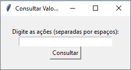
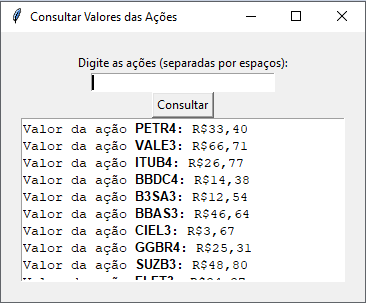

# Consultor-Acoes

Consultor Acoes é uma aplicação Python que permite visualizar os valores das ações no mercado financeiro em tempo real.

## Funcionalidades Principais

- **Consulta de Valores**: Obtenha informações atualizadas sobre o valor de ações específicas.
- **Formatação de Destaque**: Destaque as ações consultadas para fácil identificação.

## Capturas de Tela





## Pré-requisitos

Antes de começar, certifique-se de ter os seguintes requisitos instalados:

- Python 3.x
- Bibliotecas Python: requests, BeautifulSoup, tkinter

## Instalação

1. Clone este repositório:
```git clone https://github.com/danielbraguini/Consultor-Acoes.git```

2. Navegue até o diretório do projeto:
```cd Consultor-Acoes```

3. Execute o arquivo principal do aplicativo:
```python main.py```

## Contribuição

Contribuições são bem-vindas! Se você deseja melhorar este projeto, siga estas etapas:

1. Fork o projeto.
2. Crie uma nova branch com a sua funcionalidade: `git checkout -b feature/nova-funcionalidade`
3. Commit suas alterações: `git commit -m 'Adicione uma nova funcionalidade'`
4. Push para a branch: `git push origin feature/nova-funcionalidade`
5. Envie um pull request.

---

Desenvolvido por [Daniel Braguini](https://github.com/danielbraguini)
